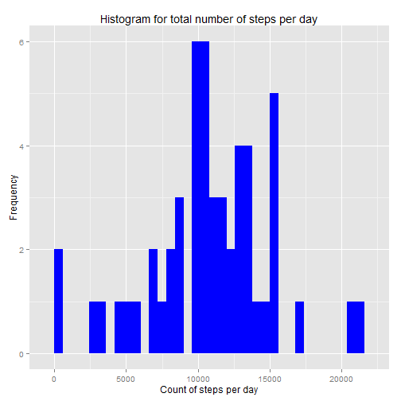
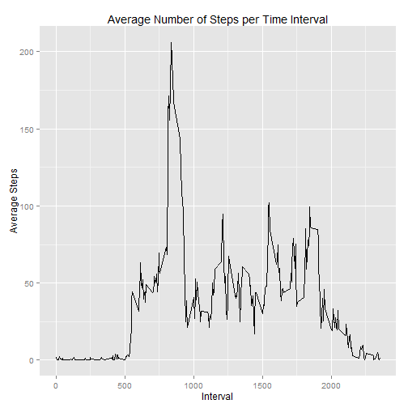
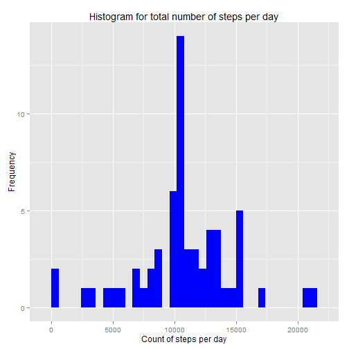
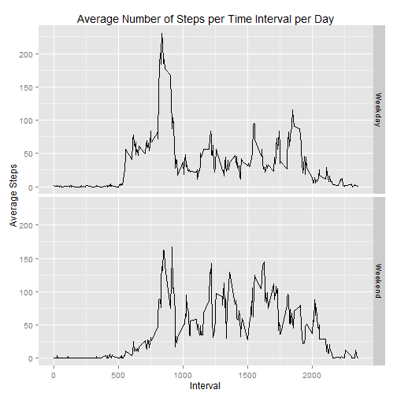

#Reproducible Research: Peer Assessment 1

###Load the libraries required

```r
library(ggplot2)
```

###Loading and preprocessing the data

Load using read.csv

```r
activity <- read.csv('activity.csv')
```

Examine the loaded data

```r
head(activity)
```

```
##   steps       date interval
## 1    NA 2012-10-01        0
## 2    NA 2012-10-01        5
## 3    NA 2012-10-01       10
## 4    NA 2012-10-01       15
## 5    NA 2012-10-01       20
## 6    NA 2012-10-01       25
```

```r
names(activity)
```

```
## [1] "steps"    "date"     "interval"
```

Preprocess the data

```r
activity$date <- as.Date(activity$date, "%Y-%m-%d")
```

###What is mean total number of steps taken per day?

Ignore the missing values

Calculate the total number of steps taken per day

Make a histogram of the total number of steps taken each day


```r
stepsperday = aggregate(steps ~ date, data = activity, sum, na.rm = TRUE)

qplot(stepsperday$steps, binwidth=600, main="Histogram for total number of steps per day", ylab="Frequency", xlab="Count of steps per day", fill=I("blue"))
```

 

Calculate and report the mean and median of the total number of steps taken per day


```r
mean <- mean(stepsperday$steps)
median <- median(stepsperday$steps)
```

Mean is 

```
## [1] 10766.19
```

Median is 

```
## [1] 10765
```

###What is the average daily activity pattern?

Make a time series plot (i.e. type = "l") of the 5-minute interval (x-axis) and the average number of steps taken, averaged across all days (y-axis)


```r
avgstepsperinterval = aggregate(x=list(steps=activity$steps), by=list(interval=activity$interval), mean, na.rm=TRUE)

ggplot(data=avgstepsperinterval, aes(interval, steps)) +
    geom_line() +
    ylab("Average Steps") +
    xlab("Interval") +
    labs(title="Average Number of Steps per Time Interval")
```

 

Which 5-minute interval, on average across all the days in the dataset, contains the maximum number of steps?


```r
intervalmaxsteps <- which.max(avgstepsperinterval$steps)
```

Interval with max number of average steps across all days is 

```
## [1] 104
```

###Imputing missing values
Calculate and report the total number of missing values in the dataset (i.e. the total number of rows with NAs)


```r
narows <- sum(is.na(activity$steps))
```

Total number of rows with NAs is


```
## [1] 2304
```

Devise a strategy for filling in all of the missing values in the dataset. The strategy used is to use the mean for that 5-minute interval for the remaining days instead of NA. 

Create a new dataset that is equal to the original dataset but with the missing data filled in.


```r
activitymod <- activity
mod <- numeric()
for (i in 1:nrow(activity)) {
    if (is.na(activity[i, ]$steps)) {
        nas <- subset(avgstepsperinterval, interval == activity[i, ]$interval)$steps
    } else {
        nas <- activity[i, ]$steps
    }
    mod <- c(mod, nas)
}

activitymod$steps <- mod
```

Missing values in the new dataset is:

```
## [1] 0
```

Make a histogram of the total number of steps taken each day and Calculate and report the mean and median total number of steps taken per day. Do these values differ from the estimates from the first part of the assignment? What is the impact of imputing missing data on the estimates of the total daily number of steps?


```r
stepsperdaymod = aggregate(steps ~ date, data = activitymod, sum, na.rm = TRUE)

qplot(stepsperdaymod$steps, binwidth=600, main="Histogram for total number of steps per day", ylab="Frequency", xlab="Count of steps per day", fill=I("blue"))
```

 

Calculate and report the mean and median of the total number of steps taken per day


```r
meanmod <- mean(stepsperdaymod$steps)
medianmod <- median(stepsperdaymod$steps)
```

Mean for modified dataset is 

```
## [1] 10766.19
```

Median for modified dataset is 

```
## [1] 10766.19
```

The mean and median do not differ a lot from the original dataset (with missing values)
The method used here is to set the steps (when missing) equal to the average number of steps for that time interval for all remaining days. The fact that mean and median do not differ much
with or without NA is because we have ignord the NA rows when taking average earlier. 
So the NA rows didnt bring down the average (by using a value of 0)
Also, since we have replaced NAs with average for the remaining dataset, the overall average is still the same. The median is just slightly different.

The total number of daily steps has gone up, since the NAs are now filled in with values > 0. 

###Are there differences in activity patterns between weekdays and weekends?

Use the dataset with the filled-in missing values for this part.

Create a new factor variable in the dataset with two levels - "weekday" and "weekend" indicating whether a given date is a weekday or weekend day.


```r
activitymod$day <-  ifelse(as.POSIXlt(activitymod$date)$wday %in% c(0,6), 'Weekend', 'Weekday')
```


Make a panel plot containing a time series plot (i.e. type = "l") of the 5-minute interval (x-axis) and the average number of steps taken, averaged across all weekday days or weekend days (y-axis). 


```r
avgstepsperintervalperday = aggregate(x=list(steps=activitymod$steps), by=list(interval=activitymod$interval, day=activitymod$day), mean, na.rm=TRUE)

ggplot(data=avgstepsperintervalperday, aes(x=interval, y=steps)) +
    geom_line() + 
    facet_grid(day ~ .) +
    ylab("Average Steps") + 
    xlab("Interval") +
    labs(title="Average Number of Steps per Time Interval per Day")
```

 

As seen from the panel plot, the peak for the average number of steps is on weekdays. However, the number of steps taken (daily average) is more on weekends as compared to weekdays.
To further verify this, this is how the average steps and max steps (peak point) compare for weekends and weekdays. 


```r
avgstepsperday = aggregate(x=list(steps=avgstepsperintervalperday$steps), by=list(day=avgstepsperintervalperday$day), mean, na.rm=TRUE)
```

Average steps for weekday vs. weekends:

```
##       day    steps
## 1 Weekday 35.61058
## 2 Weekend 42.36640
```


```r
maxstepsperday = aggregate(x=list(steps=avgstepsperintervalperday$steps), by=list(day=avgstepsperintervalperday$day), max, na.rm=TRUE)
```

Max steps (per interval) for weekday vs. weekends:

```
##       day    steps
## 1 Weekday 230.3782
## 2 Weekend 166.6392
```


